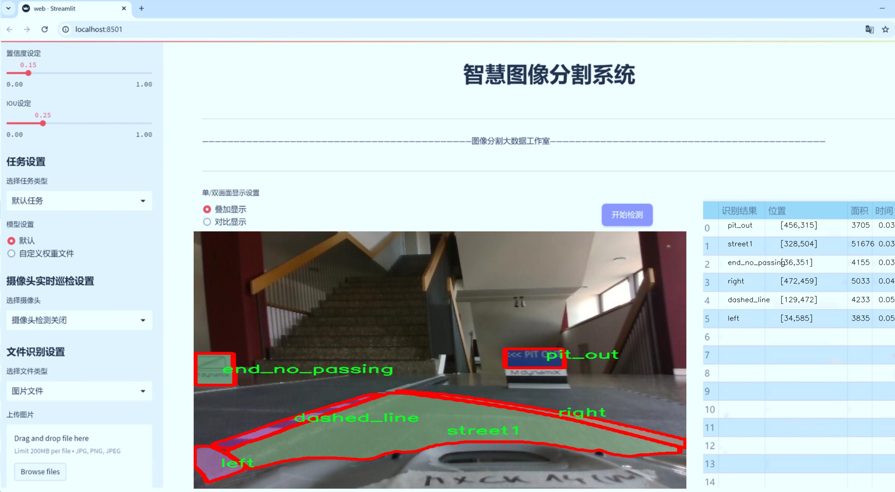
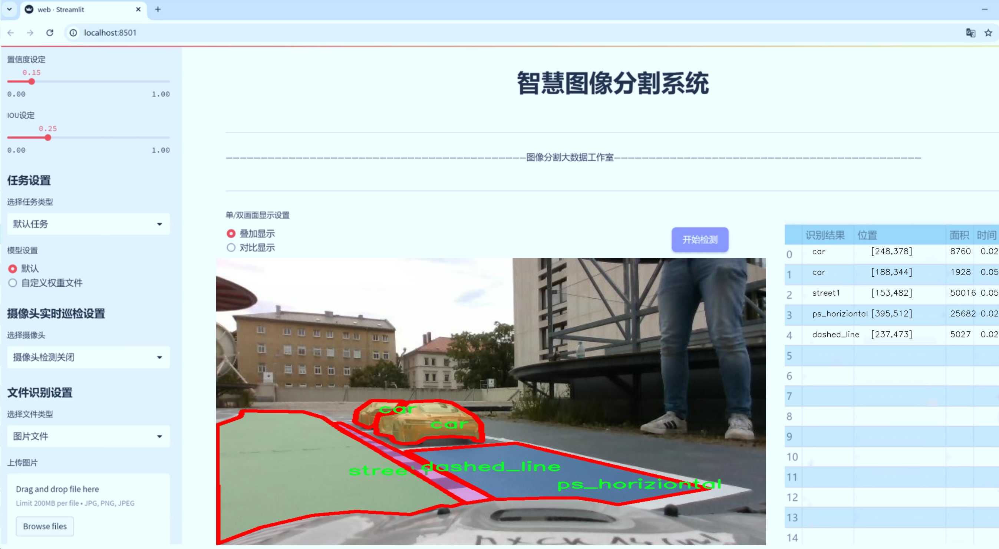
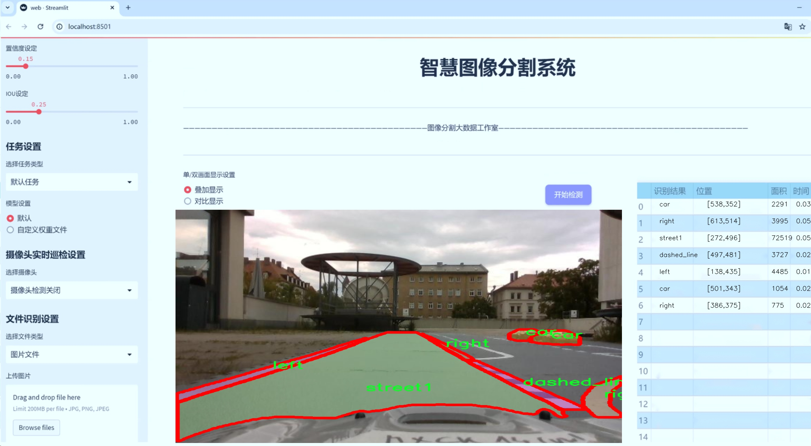
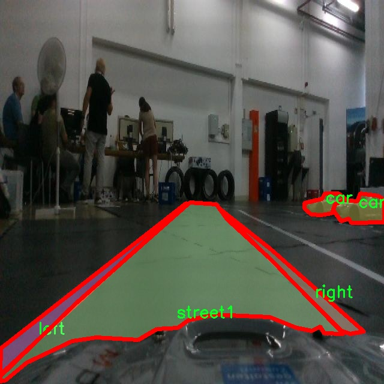
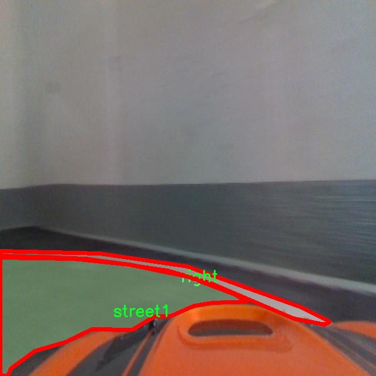
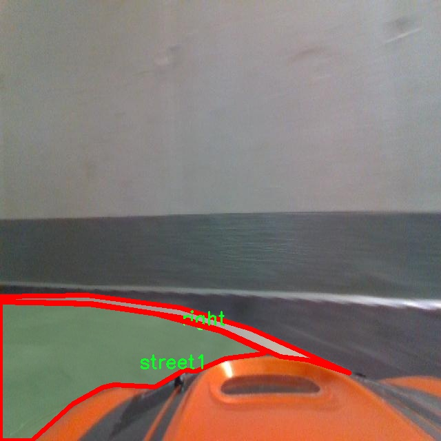
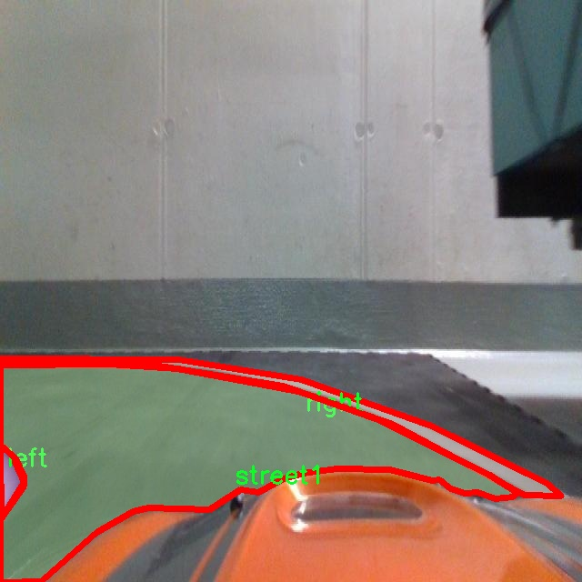
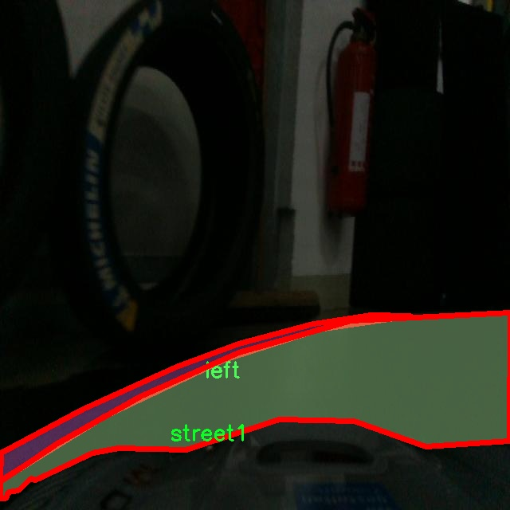

# 小车前进路径规划图像分割系统源码＆数据集分享
 [yolov8-seg-act＆yolov8-seg-fasternet-bifpn等50+全套改进创新点发刊_一键训练教程_Web前端展示]

### 1.研究背景与意义

项目参考[ILSVRC ImageNet Large Scale Visual Recognition Challenge](https://gitee.com/YOLOv8_YOLOv11_Segmentation_Studio/projects)

项目来源[AAAI Global Al lnnovation Contest](https://kdocs.cn/l/cszuIiCKVNis)

研究背景与意义

随着智能交通系统的快速发展，自动驾驶技术逐渐成为现代交通领域的重要研究方向。自动驾驶车辆的安全性和高效性依赖于其对周围环境的准确感知与理解。在这一背景下，图像分割技术作为计算机视觉领域的重要组成部分，扮演着至关重要的角色。图像分割不仅能够将图像中的目标物体与背景分离，还能为后续的路径规划、障碍物检测等任务提供必要的信息。因此，基于改进YOLOv8的小车前进路径规划图像分割系统的研究，具有重要的理论价值和实际意义。

YOLO（You Only Look Once）系列模型以其高效的实时目标检测能力而广受欢迎。YOLOv8作为该系列的最新版本，进一步提升了检测精度和速度，适用于复杂环境下的目标识别任务。然而，传统的YOLO模型在处理复杂场景时，尤其是在图像分割方面仍存在一定的局限性。因此，针对YOLOv8进行改进，以增强其在小车前进路径规划中的图像分割能力，具有重要的研究意义。

本研究所使用的数据集“obj_lane_detection”包含1100张图像，涵盖20个类别，包括车辆、停车线、路缘、交通标志等。这些类别的多样性为模型的训练提供了丰富的样本，有助于提高模型在实际应用中的泛化能力。通过对这些类别的有效分割，系统能够更准确地识别道路、障碍物及行驶路径，从而为小车的自动驾驶提供更为可靠的决策依据。

在实际应用中，路径规划不仅需要对周围环境进行准确的感知，还需要实时响应各种交通情况。改进YOLOv8的小车前进路径规划图像分割系统，能够在复杂的城市交通环境中，快速识别和分割出行驶路径、障碍物及其他重要信息。这将大大提高自动驾驶系统的安全性和效率，减少交通事故的发生率，推动智能交通系统的进一步发展。

此外，随着城市化进程的加快，交通拥堵和环境污染问题日益严重。自动驾驶技术的推广应用，有望缓解这些问题，提高交通系统的整体效率。通过改进YOLOv8实现的高效图像分割，将为智能交通系统提供更为精确的环境感知能力，从而推动自动驾驶技术的广泛应用。

综上所述，基于改进YOLOv8的小车前进路径规划图像分割系统的研究，不仅具有重要的学术价值，也为实际应用提供了可行的解决方案。通过对图像分割技术的深入研究与应用，能够为智能交通系统的安全、高效运行奠定坚实的基础，推动自动驾驶技术的进一步发展与普及。

### 2.图片演示







##### 注意：由于此博客编辑较早，上面“2.图片演示”和“3.视频演示”展示的系统图片或者视频可能为老版本，新版本在老版本的基础上升级如下：（实际效果以升级的新版本为准）

  （1）适配了YOLOV8的“目标检测”模型和“实例分割”模型，通过加载相应的权重（.pt）文件即可自适应加载模型。

  （2）支持“图片识别”、“视频识别”、“摄像头实时识别”三种识别模式。

  （3）支持“图片识别”、“视频识别”、“摄像头实时识别”三种识别结果保存导出，解决手动导出（容易卡顿出现爆内存）存在的问题，识别完自动保存结果并导出到tempDir中。

  （4）支持Web前端系统中的标题、背景图等自定义修改，后面提供修改教程。

  另外本项目提供训练的数据集和训练教程,暂不提供权重文件（best.pt）,需要您按照教程进行训练后实现图片演示和Web前端界面演示的效果。

### 3.视频演示

[3.1 视频演示](https://www.bilibili.com/video/BV1z52rYqE3X/)

### 4.数据集信息展示

##### 4.1 本项目数据集详细数据（类别数＆类别名）

nc: 20
names: ['car', 'cross_parking', 'curb_left', 'curb_right', 'dashed_line', 'end_no_passing', 'green', 'left', 'no_lights', 'no_passing', 'orange', 'parallel_parking', 'pit_in', 'pit_out', 'ps_horiziontal', 'ps_vertical', 'red', 'red_orange', 'right', 'street1']


##### 4.2 本项目数据集信息介绍

数据集信息展示

在现代智能交通系统中，图像分割技术的应用日益广泛，尤其是在小车前进路径规划方面。为此，我们构建了一个名为“obj_lane_detection”的数据集，旨在为改进YOLOv8-seg模型提供丰富的训练数据，以提升其在复杂环境下的图像分割能力。该数据集包含20个类别，涵盖了与小车行驶相关的多种场景和元素，确保模型能够准确识别和分割不同的道路特征。

数据集中包含的类别包括“car”、“cross_parking”、“curb_left”、“curb_right”、“dashed_line”、“end_no_passing”、“green”、“left”、“no_lights”、“no_passing”、“orange”、“parallel_parking”、“pit_in”、“pit_out”、“ps_horiziontal”、“ps_vertical”、“red”、“red_orange”、“right”和“street1”。这些类别的设计充分考虑了城市道路和停车场的多样性，使得模型在训练过程中能够学习到不同交通场景的特征。

首先，类别“car”代表了小车本身，是路径规划中最为关键的元素之一。通过对小车的精确识别，系统能够更好地判断其在道路上的位置，从而优化行驶路径。其次，“cross_parking”和“parallel_parking”则分别对应于交叉停车和平行停车的场景，这些类别的存在使得模型能够识别停车位的布局，进而为小车提供合适的停车策略。

在道路特征方面，“curb_left”和“curb_right”分别表示左侧和右侧的路缘石，这些信息对于小车的行驶安全至关重要。通过准确识别路缘石，系统能够避免小车驶出安全范围，确保行驶过程的平稳与安全。此外，“dashed_line”、“end_no_passing”、“no_passing”等类别则提供了关于道路标线和禁行区域的重要信息，这些信息能够帮助小车在复杂的交通环境中做出正确的决策。

颜色信号也是路径规划中不可或缺的元素。数据集中的“red”、“green”、“orange”等类别分别对应于交通信号灯的不同状态，这些信息对于小车的行驶决策至关重要。通过学习这些信号，模型能够在行驶过程中实时判断何时停车、何时继续行驶，从而提高交通效率和安全性。

最后，类别“street1”代表了一种特定的街道类型，可能涵盖了多种路况和交通情况。这一类别的引入，使得模型在处理不同街道时能够更具适应性，从而提高其在实际应用中的表现。

综上所述，“obj_lane_detection”数据集为改进YOLOv8-seg的小车前进路径规划图像分割系统提供了全面而丰富的训练数据。通过对20个类别的精细划分，数据集不仅涵盖了小车行驶过程中可能遇到的各种场景和元素，还为模型的训练提供了坚实的基础。这将有助于提升模型在实际应用中的表现，推动智能交通系统的进一步发展。











### 5.全套项目环境部署视频教程（零基础手把手教学）

[5.1 环境部署教程链接（零基础手把手教学）](https://www.bilibili.com/video/BV1jG4Ve4E9t/?vd_source=bc9aec86d164b67a7004b996143742dc)


[5.2 安装Python虚拟环境创建和依赖库安装视频教程链接（零基础手把手教学）](https://www.bilibili.com/video/BV1nA4VeYEze/?vd_source=bc9aec86d164b67a7004b996143742dc)

### 6.手把手YOLOV8-seg训练视频教程（零基础小白有手就能学会）

[6.1 手把手YOLOV8-seg训练视频教程（零基础小白有手就能学会）](https://www.bilibili.com/video/BV1cA4VeYETe/?vd_source=bc9aec86d164b67a7004b996143742dc)


按照上面的训练视频教程链接加载项目提供的数据集，运行train.py即可开始训练



     Epoch   gpu_mem       box       obj       cls    labels  img_size
     1/200     0G   0.01576   0.01955  0.007536        22      1280: 100%|██████████| 849/849 [14:42<00:00,  1.04s/it]
               Class     Images     Labels          P          R     mAP@.5 mAP@.5:.95: 100%|██████████| 213/213 [01:14<00:00,  2.87it/s]
                 all       3395      17314      0.994      0.957      0.0957      0.0843

     Epoch   gpu_mem       box       obj       cls    labels  img_size
     2/200     0G   0.01578   0.01923  0.007006        22      1280: 100%|██████████| 849/849 [14:44<00:00,  1.04s/it]
               Class     Images     Labels          P          R     mAP@.5 mAP@.5:.95: 100%|██████████| 213/213 [01:12<00:00,  2.95it/s]
                 all       3395      17314      0.996      0.956      0.0957      0.0845

     Epoch   gpu_mem       box       obj       cls    labels  img_size
     3/200     0G   0.01561    0.0191  0.006895        27      1280: 100%|██████████| 849/849 [10:56<00:00,  1.29it/s]
               Class     Images     Labels          P          R     mAP@.5 mAP@.5:.95: 100%|███████   | 187/213 [00:52<00:00,  4.04it/s]
                 all       3395      17314      0.996      0.957      0.0957      0.0845


### 7.50+种全套YOLOV8-seg创新点代码加载调参视频教程（一键加载写好的改进模型的配置文件）

[7.1 50+种全套YOLOV8-seg创新点代码加载调参视频教程（一键加载写好的改进模型的配置文件）](https://www.bilibili.com/video/BV1Hw4VePEXv/?vd_source=bc9aec86d164b67a7004b996143742dc)

### 8.YOLOV8-seg图像分割算法原理

原始YOLOV8-seg算法原理

YOLOV8-seg算法是YOLO系列中的一项重要创新，旨在为目标检测和分割任务提供高效且准确的解决方案。该算法不仅继承了YOLO系列的高效性和实时性，还在网络结构和损失计算等方面进行了多项重要改进，以适应日益复杂的视觉识别需求。YOLOV8-seg的设计理念是通过优化网络结构和引入新的训练策略，提升模型在不同场景下的表现。

首先，YOLOV8-seg的网络结构由输入端、主干网络和检测端三部分组成。主干网络采用了CSP（Cross Stage Partial）结构，旨在提高特征提取的效率。与之前的YOLO版本相比，YOLOV8-seg在主干网络中对C3模块进行了优化，替换为更轻量的C2f模块。C2f模块结合了ELAN（Efficient Layer Aggregation Network）模块的思想，增加了更多的残差连接，使得网络在保持轻量化的同时，能够获取更加丰富的梯度信息。这种设计不仅提高了特征提取的能力，还有效降低了计算复杂度，适应了实时检测的需求。

在特征融合方面，YOLOV8-seg依然采用了PAN-FPN（Path Aggregation Network - Feature Pyramid Network）结构，但在上采样阶段删除了卷积操作。这一改进使得特征融合更加高效，能够更好地利用不同尺度的特征图进行目标检测和分割。通过这种方式，YOLOV8-seg能够在不同的分辨率下保持较高的检测精度，尤其是在小目标检测和复杂背景下的表现得到了显著提升。

YOLOV8-seg的检测端采用了最新的解耦合头结构，将分类和检测任务分离。这一设计使得模型在处理目标检测和分割任务时，能够更好地优化各自的损失函数，从而提高整体性能。此外，YOLOV8-seg摒弃了传统的Anchor-Based方法，转而采用Anchor-Free策略。这一转变不仅简化了模型的设计，还使得目标检测过程更加灵活，能够适应多种形状和尺寸的目标。

在训练过程中，YOLOV8-seg引入了动态Task-Aligned Assigner样本分配策略，这一策略能够根据当前模型的性能动态调整样本的分配，使得训练过程更加高效。同时，在数据增强方面，YOLOV8-seg在训练的最后10个epoch中关闭了马赛克增强，这一设计旨在减少训练过程中可能出现的噪声，提高模型的稳定性和泛化能力。

损失计算方面，YOLOV8-seg采用了BCELoss作为分类损失，DFLLoss和CIoULoss作为回归损失。这种损失计算策略的引入，使得模型在目标检测和分割任务中能够更好地平衡分类和定位的精度。通过对损失函数的优化，YOLOV8-seg在训练过程中能够更快地收敛，从而提高模型的整体性能。

YOLOV8-seg的设计理念不仅关注模型的准确性和速度，还考虑到实际应用中的可扩展性和灵活性。该算法在多种场景下表现出色，尤其是在复杂环境中的目标检测和分割任务中，展现了其强大的适应能力。通过将YOLOV8-seg应用于苹果采摘等实际场景，能够有效提高自动化程度，降低人工成本，推动农业领域的智能化发展。

总的来说，YOLOV8-seg算法在YOLO系列的基础上进行了多项创新，结合了最新的网络结构和训练策略，旨在为目标检测和分割任务提供更高效、更准确的解决方案。随着YOLOV8-seg的推广和应用，目标检测领域将迎来新的发展机遇，为各行各业的智能化转型提供强有力的支持。


### 9.系统功能展示（检测对象为举例，实际内容以本项目数据集为准）

图9.1.系统支持检测结果表格显示

  图9.2.系统支持置信度和IOU阈值手动调节

  图9.3.系统支持自定义加载权重文件best.pt(需要你通过步骤5中训练获得)

  图9.4.系统支持摄像头实时识别

  图9.5.系统支持图片识别

  图9.6.系统支持视频识别

  图9.7.系统支持识别结果文件自动保存

  图9.8.系统支持Excel导出检测结果数据


### 10.50+种全套YOLOV8-seg创新点原理讲解（非科班也可以轻松写刊发刊，V11版本正在科研待更新）

#### 10.1 由于篇幅限制，每个创新点的具体原理讲解就不一一展开，具体见下列网址中的创新点对应子项目的技术原理博客网址【Blog】：


[10.1 50+种全套YOLOV8-seg创新点原理讲解链接](https://gitee.com/qunmasj/good)

#### 10.2 部分改进模块原理讲解(完整的改进原理见上图和技术博客链接)【如果此小节的图加载失败可以通过CSDN或者Github搜索该博客的标题访问原始博客，原始博客图片显示正常】
### 全维动态卷积ODConv
鉴于上述讨论，我们的ODConv引入了一种多维注意机制，该机制具有并行策略，用于学习卷积核在核空间的所有四个维度上的不同注意。图提供了CondConv、DyConv和ODConv的示意性比较。

ODConv的公式：根据等式1中的符号，ODConv可定义为


 将注意力标量分配给整个卷积核。图2示出了将这四种类型的关注乘以n个卷积核的过程。原则上，这四种类型的关注是相互补充的，并且以位置、信道、滤波器和核的顺序将它们逐步乘以卷积核 
 ，使得卷积运算不同w.r.t.所有空间位置、所有输入信道、所有滤波器和输入x的所有核，提供捕获丰富上下文线索的性能保证。因此，ODConv可以显著增强CNN基本卷积运算的特征提取能力。此外，具有单个卷积核的ODConv可以与标准CondConv和DyConv竞争或优于它们，为最终模型引入的额外参数大大减少。提供了大量实验来验证这些优点。通过比较等式1和等式2，我们可以清楚地看到，ODConv是一种更广义的动态卷积。此外，当设置n=1且 所有分量均为1时，只关注滤波器方向 的ODConv将减少为：将基于输入特征的SE变量应用于卷积滤波器，然后进行卷积运算（注意原始SE（Hu等人，2018b）基于输出特征，并且用于重新校准输出特征本身）。这种SE变体是ODConv的特例。


图：将ODConv中的四种注意类型逐步乘以卷积核的示例。（a） 沿空间维度的逐位置乘法运算，（b）沿输入信道维度的逐信道乘法运算、（c）沿输出信道维度的按滤波器乘法运算，以及（d）沿卷积核空间的核维度的按核乘法运算。方法部分对符号进行了说明
实现：对于ODConv，一个关键问题是如何计算卷积核的四种关注度 。继CondConv和DyConv之后，我们还使用SE型注意力模块（Hu等人，2018b），但将多个头部作为来计算它们，其结构如图所示。具体而言，首先通过逐通道全局平均池（GAP）运算将输入压缩到具有长度的特征向量中。随后，存在完全连接（FC）层和四个头部分支。ReLU（Krizhevsky等人，2012）位于FC层之后。FC层将压缩特征向量映射到具有缩减比的低维空间（根据消融实验，我们在所有主要实验中设置 ，避免了高模型复杂度）。对于四个头部分支，每个分支都有一个输出大小如图。

### 引入ODConv的改进YOLO
参考这篇博客涵盖了引入ODConv的改进YOLOv8系统的内容，ODConv采用多维注意机制，在卷积核空间的四个维度上学习不同的注意。结合了CondConv和DyConv的优势，ODConv通过图示的四种注意类型逐步与卷积核相乘，以捕获丰富的上下文线索，提升特征提取能力。

#### ODConv结构与方法
ODConv的公式和图示展示了其关注力分配给卷积核的方式，其中四种类型的关注以位置、信道、滤波器和核的顺序逐步与卷积核相乘。这种结构保证了卷积运算不同于标准的Conv操作，能够捕获更多上下文信息，从而增强了CNN的特征提取能力。另外，单个卷积核的ODConv在性能上能够与CondConv和DyConv相竞争，并且引入的额外参数大幅减少。

ODConv的特殊之处在于其广义的动态卷积性质，同时在特定条件下（n=1且所有分量为1），它可以退化为一种特例，即只关注滤波器方向，这类似于基于输入特征的SE变体，但不同于原始SE，它基于输出特征。

#### ODConv的实现
关键问题在于如何计算卷积核的四种关注度。ODConv采用了SE型注意力模块，结合了多个头部来计算这些关注度。具体实现上，通过逐通道全局平均池运算和完全连接层，将输入压缩为特征向量，随后使用四个头部分支来计算四种不同类型的关注。这样的结构能在保持模型复杂度可控的情况下，提升了特征的表征能力。

ODConv的引入为YOLOv8带来了显著的性能提升，并且通过大量实验证明了其在特征提取方面的优越性。其结合了多维注意机制和卷积操作，为目标检测和分拣系统的提升带来了新的思路和性能突破。


### 11.项目核心源码讲解（再也不用担心看不懂代码逻辑）

#### 11.1 ultralytics\utils\callbacks\comet.py

以下是经过精简和注释的核心代码部分，主要集中在与 Comet.ml 相关的功能。代码中的注释详细解释了每个函数的作用和逻辑。

```python
# 导入必要的库
from ultralytics.utils import LOGGER, RANK, SETTINGS, TESTS_RUNNING, ops
import os
from pathlib import Path

# 尝试导入 Comet.ml 库并进行基本的检查
try:
    assert not TESTS_RUNNING  # 确保不是在测试中
    assert SETTINGS['comet'] is True  # 确保集成已启用
    import comet_ml
    assert hasattr(comet_ml, '__version__')  # 确保包不是目录
except (ImportError, AssertionError):
    comet_ml = None  # 如果导入失败，则将 comet_ml 设置为 None

def _get_comet_mode():
    """获取环境变量中设置的 Comet 模式，默认为 'online'。"""
    return os.getenv('COMET_MODE', 'online')

def _create_experiment(args):
    """创建 Comet 实验对象，仅在分布式训练的主进程中创建。"""
    if RANK not in (-1, 0):  # 仅在主进程中执行
        return
    try:
        comet_mode = _get_comet_mode()
        project_name = os.getenv('COMET_PROJECT_NAME', args.project)
        experiment = comet_ml.OfflineExperiment(project_name=project_name) if comet_mode == 'offline' else comet_ml.Experiment(project_name=project_name)
        experiment.log_parameters(vars(args))  # 记录参数
    except Exception as e:
        LOGGER.warning(f'WARNING ⚠️ Comet installed but not initialized correctly, not logging this run. {e}')

def on_train_epoch_end(trainer):
    """在每个训练周期结束时记录指标和保存批次图像。"""
    experiment = comet_ml.get_global_experiment()  # 获取当前的 Comet 实验
    if not experiment:
        return

    curr_epoch = trainer.epoch + 1  # 当前周期
    curr_step = curr_epoch * (len(trainer.train_loader.dataset) // trainer.batch_size)  # 当前步骤

    # 记录训练损失
    experiment.log_metrics(trainer.label_loss_items(trainer.tloss, prefix='train'), step=curr_step, epoch=curr_epoch)

def on_train_end(trainer):
    """在训练结束时执行操作。"""
    experiment = comet_ml.get_global_experiment()  # 获取当前的 Comet 实验
    if not experiment:
        return

    curr_epoch = trainer.epoch + 1  # 当前周期
    curr_step = curr_epoch * (len(trainer.train_loader.dataset) // trainer.batch_size)  # 当前步骤

    # 记录模型和混淆矩阵
    experiment.log_model('YOLOv8', file_or_folder=str(trainer.best), file_name='best.pt', overwrite=True)
    experiment.log_confusion_matrix(matrix=trainer.validator.confusion_matrix.matrix, labels=list(trainer.data['names'].values()), max_categories=len(trainer.data['names']), epoch=curr_epoch, step=curr_step)
    experiment.end()  # 结束实验

# 回调函数字典
callbacks = {
    'on_train_epoch_end': on_train_epoch_end,
    'on_train_end': on_train_end
} if comet_ml else {}
```

### 代码说明
1. **导入和初始化**：
   - 导入所需的库，并检查 Comet.ml 是否可用。
   - 如果不可用，则相关功能将不会执行。

2. **获取 Comet 模式**：
   - `_get_comet_mode()` 函数用于获取当前的 Comet 模式，默认为在线模式。

3. **创建实验**：
   - `_create_experiment(args)` 函数负责创建 Comet 实验对象，并记录传入的参数。

4. **训练周期结束**：
   - `on_train_epoch_end(trainer)` 函数在每个训练周期结束时被调用，记录当前的训练损失。

5. **训练结束**：
   - `on_train_end(trainer)` 函数在训练结束时被调用，记录模型和混淆矩阵，并结束实验。

6. **回调函数**：
   - 定义了一个回调函数字典，包含在训练过程中的关键事件。

这些核心部分构成了与 Comet.ml 交互的基础，允许在训练过程中记录和监控模型的性能。

这个文件是一个用于与Comet.ml集成的回调模块，主要用于在训练YOLO模型时记录和可视化训练过程中的各种指标和结果。文件中首先导入了一些必要的模块和库，并进行了基本的错误处理，确保在不运行测试时才会记录日志，并且确保Comet集成已启用。

文件中定义了一些辅助函数，这些函数主要用于获取环境变量中的配置，例如Comet的运行模式、模型名称、评估批次日志记录间隔、最大图像预测数量等。这些配置会影响后续的日志记录行为。

接下来，文件中定义了一些用于处理和格式化数据的函数。例如，`_scale_bounding_box_to_original_image_shape`函数用于将YOLOv8在训练中缩放的边界框标签恢复到原始图像的尺寸，`_format_ground_truth_annotations_for_detection`和`_format_prediction_annotations_for_detection`函数则用于格式化真实标签和模型预测的结果，以便于记录。

文件中还包含了一些用于记录混淆矩阵、图像和模型的函数。混淆矩阵用于评估模型的分类性能，图像记录则用于可视化模型在训练过程中的预测结果，模型记录则用于保存最佳训练模型的状态。

在训练的不同阶段，文件中定义了一些回调函数，例如在预训练开始时、每个训练周期结束时、拟合周期结束时和训练结束时。这些回调函数会调用前面定义的记录函数，确保在训练过程中收集到所需的所有数据并记录到Comet中。

最后，文件中定义了一个字典`callbacks`，将不同的回调函数映射到相应的事件，这样在训练过程中可以根据事件触发相应的记录操作。如果Comet.ml未正确导入，则该字典将为空，表示不进行任何记录操作。

总体而言，这个文件为YOLO模型的训练过程提供了一个全面的记录和可视化解决方案，利用Comet.ml来监控和分析模型的性能。

#### 11.2 ui.py

以下是保留的核心代码部分，并添加了详细的中文注释：

```python
import sys
import subprocess

def run_script(script_path):
    """
    使用当前 Python 环境运行指定的脚本。

    Args:
        script_path (str): 要运行的脚本路径

    Returns:
        None
    """
    # 获取当前 Python 解释器的路径
    python_path = sys.executable

    # 构建运行命令，使用 streamlit 运行指定的脚本
    command = f'"{python_path}" -m streamlit run "{script_path}"'

    # 执行命令，并等待其完成
    result = subprocess.run(command, shell=True)
    
    # 检查命令执行结果，如果返回码不为0，表示出错
    if result.returncode != 0:
        print("脚本运行出错。")

# 实例化并运行应用
if __name__ == "__main__":
    # 指定要运行的脚本路径
    script_path = "web.py"  # 这里可以直接指定脚本名，假设在当前目录下

    # 调用函数运行脚本
    run_script(script_path)
```

### 代码说明：
1. **导入模块**：
   - `sys`：用于访问与 Python 解释器紧密相关的变量和函数。
   - `subprocess`：用于执行外部命令和与其交互。

2. **`run_script` 函数**：
   - 该函数接受一个脚本路径作为参数，并使用当前 Python 环境运行该脚本。
   - 使用 `sys.executable` 获取当前 Python 解释器的路径。
   - 构建一个命令字符串，使用 `streamlit` 模块运行指定的脚本。
   - 使用 `subprocess.run` 执行命令，并等待其完成。
   - 检查命令的返回码，如果不为0，表示脚本运行出错，并打印错误信息。

3. **主程序块**：
   - 在主程序块中，指定要运行的脚本路径（这里假设脚本在当前目录下）。
   - 调用 `run_script` 函数来执行指定的脚本。

这个程序文件名为 `ui.py`，其主要功能是通过当前的 Python 环境运行一个指定的脚本。程序首先导入了必要的模块，包括 `sys`、`os` 和 `subprocess`，以及一个自定义的模块 `QtFusion.path` 中的 `abs_path` 函数。

在 `run_script` 函数中，程序接受一个参数 `script_path`，这个参数是要运行的脚本的路径。函数首先获取当前 Python 解释器的路径，并将其存储在 `python_path` 变量中。接着，程序构建了一个命令字符串，该命令使用 `streamlit` 模块来运行指定的脚本。命令的格式是 `"{python_path}" -m streamlit run "{script_path}"`，其中 `{python_path}` 和 `{script_path}` 会被实际的路径替换。

然后，程序使用 `subprocess.run` 方法执行这个命令，`shell=True` 参数表示命令将在一个新的 shell 中运行。执行完命令后，程序检查返回码 `result.returncode`，如果返回码不为 0，说明脚本运行过程中出现了错误，程序会打印出“脚本运行出错。”的提示信息。

在文件的最后部分，程序通过 `if __name__ == "__main__":` 判断是否是直接运行该脚本。如果是，它会调用 `abs_path` 函数来获取 `web.py` 脚本的绝对路径，并将这个路径传递给 `run_script` 函数，从而启动脚本的运行。

总体来说，这个程序的核心功能是封装了一个运行 Python 脚本的过程，并提供了简单的错误处理机制。

#### 11.3 ultralytics\models\rtdetr\model.py

```python
# Ultralytics YOLO 🚀, AGPL-3.0 license
"""
RT-DETR接口，基于视觉变换器的实时目标检测器。RT-DETR提供实时性能和高准确性，
在CUDA和TensorRT等加速后端中表现优异。它具有高效的混合编码器和IoU感知查询选择，
以提高检测准确性。

有关RT-DETR的更多信息，请访问：https://arxiv.org/pdf/2304.08069.pdf
"""

from ultralytics.engine.model import Model  # 导入基础模型类
from ultralytics.nn.tasks import RTDETRDetectionModel  # 导入RT-DETR检测模型

from .predict import RTDETRPredictor  # 导入预测器
from .train import RTDETRTrainer  # 导入训练器
from .val import RTDETRValidator  # 导入验证器


class RTDETR(Model):
    """
    RT-DETR模型接口。该基于视觉变换器的目标检测器提供实时性能和高准确性。
    支持高效的混合编码、IoU感知查询选择和可调的推理速度。

    属性:
        model (str): 预训练模型的路径。默认为'rtdetr-l.pt'。
    """

    def __init__(self, model='rtdetr-l.pt') -> None:
        """
        使用给定的预训练模型文件初始化RT-DETR模型。支持.pt和.yaml格式。

        参数:
            model (str): 预训练模型的路径。默认为'rtdetr-l.pt'。

        异常:
            NotImplementedError: 如果模型文件扩展名不是'pt'、'yaml'或'yml'。
        """
        # 检查模型文件的扩展名是否有效
        if model and model.split('.')[-1] not in ('pt', 'yaml', 'yml'):
            raise NotImplementedError('RT-DETR仅支持从*.pt、*.yaml或*.yml文件创建。')
        # 调用父类的初始化方法
        super().__init__(model=model, task='detect')

    @property
    def task_map(self) -> dict:
        """
        返回RT-DETR的任务映射，将任务与相应的Ultralytics类关联。

        返回:
            dict: 一个字典，将任务名称映射到RT-DETR模型的Ultralytics任务类。
        """
        return {
            'detect': {
                'predictor': RTDETRPredictor,  # 预测器类
                'validator': RTDETRValidator,  # 验证器类
                'trainer': RTDETRTrainer,  # 训练器类
                'model': RTDETRDetectionModel  # RT-DETR检测模型类
            }
        }
```

### 代码核心部分注释说明：
1. **类定义**：`RTDETR`类继承自`Model`，是RT-DETR模型的接口，提供了初始化和任务映射的功能。
2. **初始化方法**：`__init__`方法中检查模型文件的扩展名是否有效，并调用父类的初始化方法。
3. **任务映射**：`task_map`属性返回一个字典，映射了不同的任务（如预测、验证和训练）到相应的类，便于后续调用。

这个程序文件是Ultralytics YOLO框架中的一部分，主要用于实现百度的RT-DETR模型。RT-DETR是一种基于视觉变换器（Vision Transformer）的实时目标检测器，旨在提供高效的实时性能和高准确性，特别是在使用CUDA和TensorRT等加速后端时表现优异。该模型采用了高效的混合编码器和IoU（Intersection over Union）感知的查询选择机制，以提高检测的准确性。

文件中首先导入了必要的模块，包括Ultralytics引擎中的Model类、RTDETRDetectionModel类，以及用于预测、训练和验证的相关模块。接着定义了RTDETR类，它继承自Model类，作为RT-DETR模型的接口。

在RTDETR类的构造函数中，接收一个可选的参数model，默认为'rtdetr-l.pt'，表示预训练模型的路径。构造函数中还包含了对模型文件格式的检查，确保只支持.pt、.yaml和.yml格式的文件。如果提供的文件格式不符合要求，将抛出NotImplementedError异常。

RTDETR类还定义了一个名为task_map的属性，它返回一个字典，映射了与RT-DETR模型相关的任务及其对应的Ultralytics类。这些任务包括预测（predictor）、验证（validator）、训练（trainer）和模型（model），分别对应RTDETRPredictor、RTDETRValidator、RTDETRTrainer和RTDETRDetectionModel类。

总的来说，这个文件为RT-DETR模型提供了一个结构化的接口，方便用户进行目标检测任务的实现和管理。

#### 11.4 train.py

以下是经过简化和注释的核心代码部分：

```python
import os
import torch
import yaml
from ultralytics import YOLO  # 导入YOLO模型库

if __name__ == '__main__':  # 确保该模块被直接运行时才执行以下代码
    # 设置训练参数
    workers = 1  # 数据加载的工作进程数
    batch = 8  # 每个批次的样本数量
    device = "0" if torch.cuda.is_available() else "cpu"  # 检查是否有可用的GPU

    # 获取数据集配置文件的绝对路径
    data_path = abs_path(f'datasets/data/data.yaml', path_type='current')

    # 读取YAML文件，保持原有顺序
    with open(data_path, 'r') as file:
        data = yaml.load(file, Loader=yaml.FullLoader)

    # 修改数据集路径
    if 'train' in data and 'val' in data and 'test' in data:
        directory_path = os.path.dirname(data_path.replace(os.sep, '/'))  # 获取目录路径
        data['train'] = directory_path + '/train'  # 更新训练集路径
        data['val'] = directory_path + '/val'      # 更新验证集路径
        data['test'] = directory_path + '/test'    # 更新测试集路径

        # 将修改后的数据写回YAML文件
        with open(data_path, 'w') as file:
            yaml.safe_dump(data, file, sort_keys=False)

    # 加载YOLO模型配置和预训练权重
    model = YOLO(r"C:\codeseg\codenew\50+种YOLOv8算法改进源码大全和调试加载训练教程（非必要）\改进YOLOv8模型配置文件\yolov8-seg-C2f-Faster.yaml").load("./weights/yolov8s-seg.pt")

    # 开始训练模型
    results = model.train(
        data=data_path,  # 指定训练数据的配置文件路径
        device=device,  # 指定使用的设备（GPU或CPU）
        workers=workers,  # 数据加载的工作进程数
        imgsz=640,  # 输入图像的大小
        epochs=100,  # 训练的轮数
        batch=batch,  # 每个批次的样本数量
    )
```

### 代码注释说明：
1. **导入必要的库**：引入了处理文件路径、深度学习框架、YAML文件读取和YOLO模型的相关库。
2. **设置训练参数**：定义了数据加载的工作进程数、批次大小和设备选择（GPU或CPU）。
3. **读取和修改YAML配置文件**：读取数据集的配置文件，更新训练、验证和测试集的路径，并将修改后的内容写回文件。
4. **加载YOLO模型**：指定模型的配置文件和预训练权重，准备进行训练。
5. **开始训练模型**：调用模型的训练方法，传入必要的参数，包括数据路径、设备、工作进程数、图像大小、训练轮数和批次大小。

这个程序文件`train.py`主要用于训练YOLO（You Only Look Once）模型，具体来说是YOLOv8的一个变种，主要用于目标检测或分割任务。程序的结构和功能可以分为几个主要部分。

首先，程序导入了必要的库，包括`os`、`torch`、`yaml`、`ultralytics`中的YOLO模型，以及用于图形界面的`matplotlib`。这些库为后续的文件操作、深度学习模型的加载和训练提供了支持。

接下来，程序的主逻辑在`if __name__ == '__main__':`块中执行，确保只有在直接运行该脚本时才会执行其中的代码。程序首先设置了一些训练参数，包括工作进程数`workers`、批次大小`batch`、以及设备选择`device`。设备选择逻辑是，如果系统中有可用的GPU，则使用GPU（设备编号为"0"），否则使用CPU。

然后，程序通过`abs_path`函数获取数据集配置文件`data.yaml`的绝对路径，并将路径格式转换为Unix风格，以便于后续的文件操作。接着，程序读取YAML文件内容，并将训练、验证和测试数据的路径修改为相对于当前目录的路径。修改完成后，程序将更新后的数据写回到原YAML文件中。

在模型加载部分，程序使用YOLO模型的配置文件加载预训练的YOLOv8模型权重。这里的模型配置文件和权重文件路径是硬编码的，用户可以根据需要进行调整。

最后，程序调用`model.train()`方法开始训练模型，传入的数据配置文件路径、设备、工作进程数、输入图像大小、训练的epoch数量和批次大小等参数。通过这些设置，程序将启动训练过程，模型将根据提供的数据进行学习。

总体来说，这个程序文件是一个完整的YOLOv8模型训练脚本，涵盖了数据准备、模型加载和训练过程的各个环节，适合用于目标检测或分割任务的深度学习研究和应用。

#### 11.5 ultralytics\data\build.py

以下是经过简化和注释的核心代码部分：

```python
import os
import random
import numpy as np
import torch
from torch.utils.data import dataloader
from .dataset import YOLODataset  # 导入YOLO数据集类
from .utils import PIN_MEMORY  # 导入内存固定设置

class InfiniteDataLoader(dataloader.DataLoader):
    """
    无限循环的数据加载器，继承自PyTorch的DataLoader。
    """

    def __init__(self, *args, **kwargs):
        """初始化InfiniteDataLoader，重用工作线程。"""
        super().__init__(*args, **kwargs)
        # 使用自定义的重复采样器
        object.__setattr__(self, 'batch_sampler', _RepeatSampler(self.batch_sampler))
        self.iterator = super().__iter__()

    def __len__(self):
        """返回批次采样器的长度。"""
        return len(self.batch_sampler.sampler)

    def __iter__(self):
        """创建一个无限重复的迭代器。"""
        for _ in range(len(self)):
            yield next(self.iterator)

    def reset(self):
        """重置迭代器，便于在训练时修改数据集设置。"""
        self.iterator = self._get_iterator()

class _RepeatSampler:
    """
    无限重复的采样器。
    """

    def __init__(self, sampler):
        """初始化重复采样器。"""
        self.sampler = sampler

    def __iter__(self):
        """无限迭代采样器的内容。"""
        while True:
            yield from iter(self.sampler)

def seed_worker(worker_id):
    """设置数据加载器工作线程的随机种子。"""
    worker_seed = torch.initial_seed() % 2 ** 32
    np.random.seed(worker_seed)
    random.seed(worker_seed)

def build_yolo_dataset(cfg, img_path, batch, data, mode='train', rect=False, stride=32):
    """构建YOLO数据集。"""
    return YOLODataset(
        img_path=img_path,
        imgsz=cfg.imgsz,  # 图像大小
        batch_size=batch,  # 批次大小
        augment=mode == 'train',  # 是否进行数据增强
        hyp=cfg,  # 超参数配置
        rect=cfg.rect or rect,  # 是否使用矩形批次
        cache=cfg.cache or None,  # 缓存设置
        single_cls=cfg.single_cls or False,  # 是否单类
        stride=int(stride),  # 步幅
        pad=0.0 if mode == 'train' else 0.5,  # 填充
        classes=cfg.classes,  # 类别
        data=data,  # 数据集配置
        fraction=cfg.fraction if mode == 'train' else 1.0  # 训练时的样本比例
    )

def build_dataloader(dataset, batch, workers, shuffle=True, rank=-1):
    """返回用于训练或验证集的InfiniteDataLoader或DataLoader。"""
    batch = min(batch, len(dataset))  # 确保批次不超过数据集大小
    nd = torch.cuda.device_count()  # CUDA设备数量
    nw = min([os.cpu_count() // max(nd, 1), batch if batch > 1 else 0, workers])  # 工作线程数量
    sampler = None if rank == -1 else distributed.DistributedSampler(dataset, shuffle=shuffle)  # 分布式采样器
    generator = torch.Generator()
    generator.manual_seed(6148914691236517205 + RANK)  # 设置随机种子
    return InfiniteDataLoader(dataset=dataset,
                              batch_size=batch,
                              shuffle=shuffle and sampler is None,
                              num_workers=nw,
                              sampler=sampler,
                              pin_memory=PIN_MEMORY,
                              worker_init_fn=seed_worker)  # 初始化工作线程的随机种子

def check_source(source):
    """检查输入源类型并返回相应的标志值。"""
    # 初始化标志
    webcam, screenshot, from_img, in_memory, tensor = False, False, False, False, False
    if isinstance(source, (str, int, Path)):  # 处理字符串、整数或路径
        source = str(source)
        is_file = Path(source).suffix[1:] in (IMG_FORMATS + VID_FORMATS)  # 检查是否为文件
        is_url = source.lower().startswith(('https://', 'http://', 'rtsp://', 'rtmp://', 'tcp://'))  # 检查是否为URL
        webcam = source.isnumeric() or source.endswith('.streams') or (is_url and not is_file)  # 检查是否为摄像头
        screenshot = source.lower() == 'screen'  # 检查是否为屏幕截图
    elif isinstance(source, LOADERS):
        in_memory = True  # 如果是LOADERS类型，设置为内存中
    elif isinstance(source, (list, tuple)):
        source = autocast_list(source)  # 转换列表元素为PIL或numpy数组
        from_img = True
    elif isinstance(source, (Image.Image, np.ndarray)):
        from_img = True  # 如果是图像或数组
    elif isinstance(source, torch.Tensor):
        tensor = True  # 如果是张量
    else:
        raise TypeError('不支持的图像类型。')

    return source, webcam, screenshot, from_img, in_memory, tensor  # 返回源及其类型标志

def load_inference_source(source=None, imgsz=640, vid_stride=1, buffer=False):
    """加载用于推理的输入源并应用必要的转换。"""
    source, webcam, screenshot, from_img, in_memory, tensor = check_source(source)  # 检查源类型
    # 根据源类型加载相应的数据集
    if tensor:
        dataset = LoadTensor(source)
    elif in_memory:
        dataset = source
    elif webcam:
        dataset = LoadStreams(source, imgsz=imgsz, vid_stride=vid_stride, buffer=buffer)
    elif screenshot:
        dataset = LoadScreenshots(source, imgsz=imgsz)
    elif from_img:
        dataset = LoadPilAndNumpy(source, imgsz=imgsz)
    else:
        dataset = LoadImages(source, imgsz=imgsz, vid_stride=vid_stride)

    return dataset  # 返回加载的数据集
```

### 代码说明：
1. **InfiniteDataLoader**：自定义的数据加载器，能够无限循环读取数据，适合训练时使用。
2. **_RepeatSampler**：实现无限重复的采样器，确保数据可以不断被迭代。
3. **seed_worker**：设置随机种子，确保数据加载过程中的随机性可控。
4. **build_yolo_dataset**：构建YOLO数据集，配置数据集的各项参数。
5. **build_dataloader**：创建数据加载器，配置批次大小、工作线程等。
6. **check_source**：检查输入源的类型，判断是文件、摄像头、图像等，并返回相应的标志。
7. **load_inference_source**：加载推理所需的输入源，返回适合推理的数据集对象。

这个程序文件是用于构建和管理YOLO（You Only Look Once）目标检测模型的数据加载器。它主要包括几个重要的类和函数，用于处理数据集的加载、采样和预处理。

首先，文件导入了一些必要的库，包括操作系统、随机数生成、路径处理、NumPy、PyTorch、PIL图像处理库等。这些库为数据加载和处理提供了基础功能。

接下来，定义了一个名为`InfiniteDataLoader`的类，它继承自PyTorch的`DataLoader`。这个类的特点是可以无限循环地使用工作线程，适用于需要不断迭代的数据加载场景。它重写了`__len__`和`__iter__`方法，使得数据加载器可以在没有明确结束的情况下持续提供数据。此外，它还提供了一个`reset`方法，可以在训练过程中重置迭代器，以便在修改数据集设置时使用。

内部的`_RepeatSampler`类则是一个无限重复的采样器，能够不断迭代给定的采样器，确保数据加载的连续性。

`seed_worker`函数用于设置数据加载器工作线程的随机种子，以确保每次运行时数据的随机性可控，避免因随机性导致的结果不一致。

`build_yolo_dataset`函数用于构建YOLO数据集，接收配置参数、图像路径、批次大小等信息，返回一个`YOLODataset`对象。这个函数根据训练模式决定是否进行数据增强，并设置一些与数据集相关的参数。

`build_dataloader`函数则是用于创建数据加载器的函数，它会根据传入的数据集、批次大小、工作线程数量等参数，返回一个`InfiniteDataLoader`或普通的`DataLoader`。它还会处理分布式训练的情况，确保在多GPU环境下的数据加载效率。

`check_source`函数用于检查输入数据源的类型，判断其是来自文件、摄像头、内存、图像、视频等，并返回相应的标志值。这对于后续的数据加载和处理至关重要。

最后，`load_inference_source`函数用于加载推理源，支持多种输入类型，包括字符串路径、Tensor、PIL图像和NumPy数组等。根据输入类型，它会选择合适的加载方式，并返回一个数据集对象。

总体而言，这个文件提供了一套完整的数据加载和处理机制，旨在支持YOLO模型的训练和推理过程，确保数据的高效和灵活处理。

#### 11.6 model.py

以下是代码中最核心的部分，并附上详细的中文注释：

```python
# -*- coding: utf-8 -*-
import cv2  # 导入OpenCV库，用于处理图像和视频
import torch  # 导入PyTorch库，用于深度学习模型的操作
from ultralytics import YOLO  # 从ultralytics库中导入YOLO类，用于加载YOLO模型
from ultralytics.utils.torch_utils import select_device  # 导入设备选择函数

# 选择计算设备，如果有可用的GPU则使用CUDA，否则使用CPU
device = "cuda:0" if torch.cuda.is_available() else "cpu"

# 初始化参数字典
ini_params = {
    'device': device,  # 设备类型
    'conf': 0.3,  # 物体置信度阈值
    'iou': 0.05,  # 非极大值抑制的IOU阈值
    'classes': None,  # 类别过滤器
    'verbose': False  # 是否输出详细信息
}

class Web_Detector:  # 定义Web_Detector类
    def __init__(self, params=None):  # 构造函数
        self.model = None  # 初始化模型为None
        self.img = None  # 初始化图像为None
        self.params = params if params else ini_params  # 设置参数

    def load_model(self, model_path):  # 加载模型的方法
        self.device = select_device(self.params['device'])  # 选择计算设备
        self.model = YOLO(model_path)  # 加载YOLO模型
        # 预热模型以提高后续推理速度
        self.model(torch.zeros(1, 3, 640, 640).to(self.device).type_as(next(self.model.model.parameters())))

    def preprocess(self, img):  # 图像预处理方法
        self.img = img  # 保存原始图像
        return img  # 返回处理后的图像

    def predict(self, img):  # 预测方法
        results = self.model(img, **ini_params)  # 使用模型进行预测
        return results  # 返回预测结果

    def postprocess(self, pred):  # 后处理方法
        results = []  # 初始化结果列表
        for res in pred[0].boxes:  # 遍历预测结果中的每个边界框
            class_id = int(res.cls.cpu())  # 获取类别ID
            bbox = res.xyxy.cpu().squeeze().tolist()  # 获取边界框坐标
            bbox = [int(coord) for coord in bbox]  # 转换为整数

            result = {
                "class_name": self.model.names[class_id],  # 类别名称
                "bbox": bbox,  # 边界框
                "score": res.conf.cpu().squeeze().item(),  # 置信度
                "class_id": class_id  # 类别ID
            }
            results.append(result)  # 将结果添加到列表

        return results  # 返回结果列表
```

### 代码核心部分说明：
1. **设备选择**：根据是否有可用的GPU来选择计算设备。
2. **参数初始化**：定义了模型推理所需的参数，包括置信度阈值和IOU阈值。
3. **模型加载**：通过`load_model`方法加载YOLO模型，并进行预热以提高推理速度。
4. **图像预处理**：`preprocess`方法用于保存原始图像，便于后续处理。
5. **预测**：`predict`方法使用加载的模型对输入图像进行预测。
6. **后处理**：`postprocess`方法对预测结果进行处理，提取类别名称、边界框、置信度等信息，并返回结构化的结果列表。

这个程序文件`model.py`主要用于实现一个基于YOLO（You Only Look Once）模型的目标检测器，利用OpenCV和PyTorch库进行图像处理和深度学习模型的操作。文件中首先导入了必要的库和模块，包括OpenCV用于图像处理，PyTorch用于深度学习，QtFusion中的Detector和HeatmapGenerator类，以及从ultralytics库中导入的YOLO类和设备选择函数。

程序开始时，定义了一个设备变量`device`，根据是否有可用的CUDA设备来选择使用GPU还是CPU。接着，初始化了一些参数，包括物体置信度阈值、IOU阈值和类别过滤器等，这些参数在后续的模型推理中会被使用。

接下来，定义了一个`count_classes`函数，用于统计检测结果中每个类别的数量。该函数接收检测信息和类别名称列表，遍历检测信息并更新每个类别的计数，最后返回一个与类别名称顺序一致的计数列表。

然后，定义了一个名为`Web_Detector`的类，继承自`Detector`类。这个类的构造函数初始化了一些属性，包括模型、图像和类别名称等。`load_model`方法用于加载YOLO模型，并根据模型路径判断任务类型（分割或检测），同时将类别名称转换为中文。

`preprocess`方法用于对输入图像进行预处理，保存原始图像并返回处理后的图像。`predict`方法则使用加载的模型对输入图像进行预测，返回预测结果。

在`postprocess`方法中，对模型的预测结果进行后处理，提取出每个检测框的类别名称、边界框坐标、置信度和类别ID等信息，并将这些信息组织成字典形式，最终返回一个包含所有检测结果的列表。

最后，`set_param`方法用于更新检测器的参数，允许用户在运行时修改模型的配置。整体来看，这个程序文件实现了一个完整的目标检测流程，从模型加载到图像预处理、预测和后处理，适用于基于YOLO的目标检测任务。

### 12.系统整体结构（节选）

### 整体功能和构架概括

该项目主要围绕YOLO（You Only Look Once）系列目标检测模型的实现与训练，提供了一整套工具和模块来支持模型的训练、推理、数据处理和可视化。项目的架构分为多个模块，每个模块负责特定的功能，包括数据加载、模型定义、训练过程、推理和结果记录等。以下是各个文件的功能概述：

| 文件路径                                           | 功能描述                                                     |
|---------------------------------------------------|------------------------------------------------------------|
| `ultralytics/utils/callbacks/comet.py`           | 集成Comet.ml进行训练过程中的日志记录和可视化。               |
| `ui.py`                                          | 启动指定的Python脚本，主要用于运行图形用户界面（GUI）。      |
| `ultralytics/models/rtdetr/model.py`             | 实现RT-DETR模型，提供模型的接口和相关功能。                  |
| `train.py`                                       | 训练YOLO模型，处理数据集配置和模型训练参数。                |
| `ultralytics/data/build.py`                      | 构建和管理YOLO数据加载器，支持数据集的加载和预处理。         |
| `model.py`                                       | 实现YOLO目标检测器，处理图像的预处理、预测和后处理。        |
| `ultralytics/nn/extra_modules/afpn.py`          | 实现自适应特征金字塔网络（AFPN），用于增强特征提取。         |
| `ultralytics/utils/loss.py`                      | 定义损失函数，计算模型训练过程中的损失值。                   |
| `ultralytics/solutions/object_counter.py`        | 实现目标计数功能，基于检测结果进行目标数量统计。             |
| `ultralytics/nn/backbone/convnextv2.py`         | 实现ConvNeXt V2网络结构，作为YOLO模型的骨干网络。           |
| `ultralytics/models/fastsam/prompt.py`          | 实现快速分割和提示功能，支持图像分割任务。                   |
| `ultralytics/nn/extra_modules/kernel_warehouse.py`| 提供卷积核仓库功能，支持动态卷积核的管理和应用。            |
| `ultralytics/utils/callbacks/tensorboard.py`    | 集成TensorBoard进行训练过程中的可视化和日志记录。           |

### 总结

整体而言，该项目通过模块化的设计，提供了一个完整的目标检测解决方案，涵盖了从数据处理、模型训练到结果记录和可视化的各个方面，便于用户进行目标检测任务的实现和优化。

注意：由于此博客编辑较早，上面“11.项目核心源码讲解（再也不用担心看不懂代码逻辑）”中部分代码可能会优化升级，仅供参考学习，完整“训练源码”、“Web前端界面”和“50+种创新点源码”以“14.完整训练+Web前端界面+50+种创新点源码、数据集获取”的内容为准。

### 13.图片、视频、摄像头图像分割Demo(去除WebUI)代码

在这个博客小节中，我们将讨论如何在不使用WebUI的情况下，实现图像分割模型的使用。本项目代码已经优化整合，方便用户将分割功能嵌入自己的项目中。
核心功能包括图片、视频、摄像头图像的分割，ROI区域的轮廓提取、类别分类、周长计算、面积计算、圆度计算以及颜色提取等。
这些功能提供了良好的二次开发基础。

### 核心代码解读

以下是主要代码片段，我们会为每一块代码进行详细的批注解释：

```python
import random
import cv2
import numpy as np
from PIL import ImageFont, ImageDraw, Image
from hashlib import md5
from model import Web_Detector
from chinese_name_list import Label_list

# 根据名称生成颜色
def generate_color_based_on_name(name):
    ......

# 计算多边形面积
def calculate_polygon_area(points):
    return cv2.contourArea(points.astype(np.float32))

...
# 绘制中文标签
def draw_with_chinese(image, text, position, font_size=20, color=(255, 0, 0)):
    image_pil = Image.fromarray(cv2.cvtColor(image, cv2.COLOR_BGR2RGB))
    draw = ImageDraw.Draw(image_pil)
    font = ImageFont.truetype("simsun.ttc", font_size, encoding="unic")
    draw.text(position, text, font=font, fill=color)
    return cv2.cvtColor(np.array(image_pil), cv2.COLOR_RGB2BGR)

# 动态调整参数
def adjust_parameter(image_size, base_size=1000):
    max_size = max(image_size)
    return max_size / base_size

# 绘制检测结果
def draw_detections(image, info, alpha=0.2):
    name, bbox, conf, cls_id, mask = info['class_name'], info['bbox'], info['score'], info['class_id'], info['mask']
    adjust_param = adjust_parameter(image.shape[:2])
    spacing = int(20 * adjust_param)

    if mask is None:
        x1, y1, x2, y2 = bbox
        aim_frame_area = (x2 - x1) * (y2 - y1)
        cv2.rectangle(image, (x1, y1), (x2, y2), color=(0, 0, 255), thickness=int(3 * adjust_param))
        image = draw_with_chinese(image, name, (x1, y1 - int(30 * adjust_param)), font_size=int(35 * adjust_param))
        y_offset = int(50 * adjust_param)  # 类别名称上方绘制，其下方留出空间
    else:
        mask_points = np.concatenate(mask)
        aim_frame_area = calculate_polygon_area(mask_points)
        mask_color = generate_color_based_on_name(name)
        try:
            overlay = image.copy()
            cv2.fillPoly(overlay, [mask_points.astype(np.int32)], mask_color)
            image = cv2.addWeighted(overlay, 0.3, image, 0.7, 0)
            cv2.drawContours(image, [mask_points.astype(np.int32)], -1, (0, 0, 255), thickness=int(8 * adjust_param))

            # 计算面积、周长、圆度
            area = cv2.contourArea(mask_points.astype(np.int32))
            perimeter = cv2.arcLength(mask_points.astype(np.int32), True)
            ......

            # 计算色彩
            mask = np.zeros(image.shape[:2], dtype=np.uint8)
            cv2.drawContours(mask, [mask_points.astype(np.int32)], -1, 255, -1)
            color_points = cv2.findNonZero(mask)
            ......

            # 绘制类别名称
            x, y = np.min(mask_points, axis=0).astype(int)
            image = draw_with_chinese(image, name, (x, y - int(30 * adjust_param)), font_size=int(35 * adjust_param))
            y_offset = int(50 * adjust_param)

            # 绘制面积、周长、圆度和色彩值
            metrics = [("Area", area), ("Perimeter", perimeter), ("Circularity", circularity), ("Color", color_str)]
            for idx, (metric_name, metric_value) in enumerate(metrics):
                ......

    return image, aim_frame_area

# 处理每帧图像
def process_frame(model, image):
    pre_img = model.preprocess(image)
    pred = model.predict(pre_img)
    det = pred[0] if det is not None and len(det)
    if det:
        det_info = model.postprocess(pred)
        for info in det_info:
            image, _ = draw_detections(image, info)
    return image

if __name__ == "__main__":
    cls_name = Label_list
    model = Web_Detector()
    model.load_model("./weights/yolov8s-seg.pt")

    # 摄像头实时处理
    cap = cv2.VideoCapture(0)
    while cap.isOpened():
        ret, frame = cap.read()
        if not ret:
            break
        ......

    # 图片处理
    image_path = './icon/OIP.jpg'
    image = cv2.imread(image_path)
    if image is not None:
        processed_image = process_frame(model, image)
        ......

    # 视频处理
    video_path = ''  # 输入视频的路径
    cap = cv2.VideoCapture(video_path)
    while cap.isOpened():
        ret, frame = cap.read()
        ......
```


### 14.完整训练+Web前端界面+50+种创新点源码、数据集获取


# [下载链接：https://mbd.pub/o/bread/Zp2Ukppy](https://mbd.pub/o/bread/Zp2Ukppy)